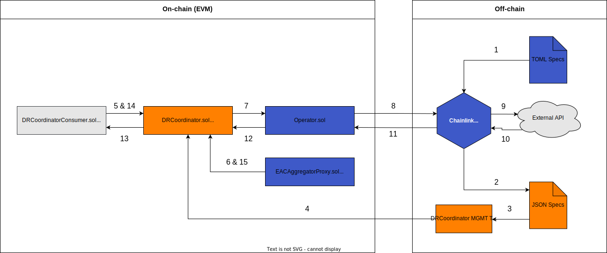
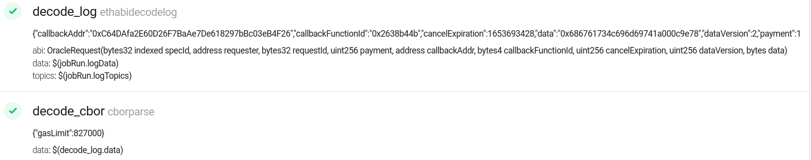
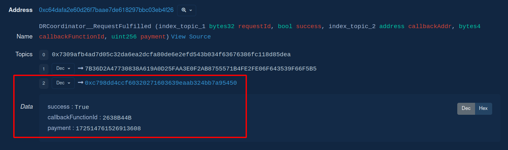
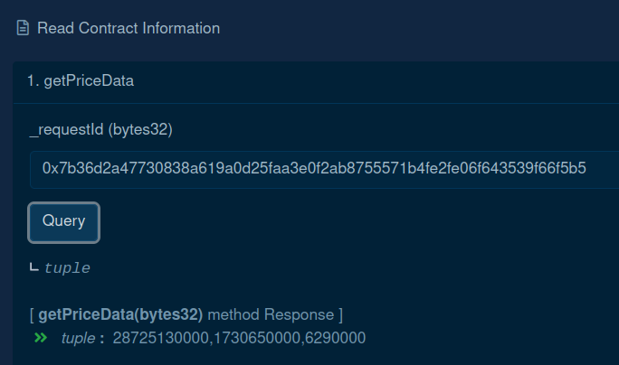

# Direct Request Coordinator

A framework composed of contracts and job spec management tools, that enable a data requester to pay to a node operator only as much LINK is required to cover the gas costs incurred by the data delivery, plus some profit margin set by the node operator.

## Inspiration

Chainlink provides a wide variety of products and services. The market demand has reasonably caused that few of them evolve more than others. Unfortunately, the Direct Request model is lagging and its supporting tooling requires updating to help it to power the next wave of blockchain adoption by connecting smart contracts to the real world.

### The Direct Request Model

The demand for accessing any external data source through decentralised oracle networks is increasing. Chainlink's framework allows requesting off-chain data via the the Basic Request Model (known as well as Direct Request).

On the Direct Request model, a `ChainlinkClient` contract (known as well as consumer) builds a sends a Chainlink Request to an oracle contract (either `Oracle` or `Operator`, owned by the Node Operator). The Chainlink Request is a package of information to make an API request, and it is transferred from the consumer to the oracle attached in the LINK token (ERC-677 compliant). On this transfer of value an `OracleRequest` event, that includes the Chainlink Request package among other data, is emitted and captured by the off-chain part of the framework: the Chainlink node. Upon detecting the event, it decodes it and uses the request data to perform a job. Each job defines (via its Job Spec, known as well as job/spec/job spec) a series of tasks, e.g. requesting an API, processing the response, and eventually make a transaction on-chain with the result of the job run (execution). This result is submitted by the node back to the oracle contract, which returns it to the consumer one (known as well as fulfilling the request).

### The Problem

In the current Direct Request model, the payment that the node-operator receives for running a job is statically defined in the Job Spec. This has at least the following implications:

- The LINK amount is fixed on the off-chain side.
- The whole LINK amount is transferred (paid) first on-chain from the consumer to the oracle before running the job (where it stays in escrow until fulfillment).

It also has the following implications based on my own experience and/or just having a thought:

- If the consumer makes a mistake on the information the Chainlink Request handles, or the job run fails, the whole LINK amount has already been paid. Not many consumers are aware that it is held in escrow in the oracle contract (as a pending request to be fulfilled), and that it is 100% refundable (via `cancelRequest`). So they give it up for lost.
- The node operator pays for the fulfillment transaction. The resulting response size, and the Consumer's fulfillment function determine the amount of gas used. No matter how much gas is used, due to the gas market of the network, the payment amount is fixed per the job spec. It is true though, that the node operator can set a `gasLimit` on the job spec. However, it is reasonable to think that the node operator will always set a LINK amount high enough to offset any potential losses writing the result on-chain.
- In general, the node operator manages manually each job spec payment via the node GUI (alternatively SQL can be used, though it is not recommended). On the Chainlink node v1.0.0 the `minContractPaymentLinkJuels` (the field that defines a payment) was hidden and it did now show up until v1.4.0, making it almost required to track job spec payments internally (e.g. spreadsheets, notes).
- There are job specs whose result varies in size, using differents amounts of gas, yet the payment amount is fixed. Although multiple jobs with different prices could be forked from a single parent spec, with differing minimum payments and maximum gas limits, this is an onerous process. Moreover, it increases the amount of jobs to track, and manage via GUI.
- A node operator can manage multiple nodes per network, and support multiple networks. Each network has its particular gas and token(s) pricing.
- The LINK token and the gas prices are subject to market fluctuations. Depending on the amount of jobs to manage, and the timing of the events, it is unrealistic keeping the prices up to date. Abrupt gas spikes are concerning events too. Extra time is added if the job payment is internally tracked and/or shown on 3rd party services, e.g. [market.link](https://market.link/).
- Node operators are accountable and have to calculate finances; deterministic profits matter.

What if...:

- The Direct Request model adopted the same major improvements VRF v2 had? Pay-as-you-go based on the gas used on request fulfillment plus some profit margin set by the node operator (paid in LINK leveraging the Chainlink Price Feeds). On-demand callback `gasLimit` set by the requester. And a versatile subscription model that eases funding the requests.
- Node operators didn't have to defensively price a job, and/or dialing up the `gasLimit` due to dynamic size results and the unknown complexity of the consumer's fulfillment function?
- They didn't have to worry anymore about network gas & token prices and conversions, gas spikes, market volatility, and just focus on job profit margin?
- The "last mile" of listing a job wasn't that time consuming and inaccurate?
- The essential job spec details were on-chain, being publicly accessible by 3rd party services and the node operator itself?
- Not the full payment amount was paid before running the job, and just a tiny value was in escrow?
- Node operators had a framework to manage all of this?

Well, these were the motivations behind presenting Direct Request Coordinator (aka, Dr Coordinator) on the Spring '22 Hackaton. OK;LG.

## What it does

A framework composed of contracts and job spec management tools, that enable a data requester to pay to a node operator only as much LINK is required to cover the gas costs incurred by the data delivery, plus some profit margin set by the node operator.

### Architecture & Flow



To describe the framework tool, a [similar job spec](./specs-toml/drcoordinator/sportsdataio-get-schedule-v1.0.0-fallback.toml) to the [MultiWord Example Job Spec](https://docs.chain.link/docs/direct-request-multi-word/) from the Chainlink docs will be used as an example:

As a pre-requisite a [DRCoordinator](./contracts/drcoordinator/DRCoordinator.sol) has to be already deployed, alongside a [DRCConsumerCryptoCompare](./contracts/drcoordinator/DRCConsumerCryptoCompare.sol) too.

1. The [TOML Job Spec](./specs-toml/drcoordinator/sportsdataio-get-schedule-v1.0.0-fallback.toml) is added in the Chainlink node setting the following fields and parameters:

   - The `requesters` field whitelists the DRCoordinator address.
   - The `minContractPaymentLinkJuels` field defines the initial payment amount the consumer pays to the oracle just for triggering a job run.
   - The `ethtx` task populates the parameters `minConfirmations` and `gasLimit` from the `cborparse` task output. BE AWARE: there is currently a bug that prevents setting `minConfirmations` ([GitHub issue](https://github.com/smartcontractkit/chainlink/issues/6680))

2. The [JSON Spec](./specs/example.json) is created with the `externalJobId` & `payment` (shown on the job detail page) and another params up to the node operator (e.g. `gasLimit`, `minConfirmations`, `feeType` & `fulfillmentFee`).

3. The JSON Spec is uploaded into `DRCoordinator` using the [management tools](./tasks/drcoordinator/README.md)

4. Once any EOA has funded with LINK the `DRCConsumerCryptoCompare` balance in `DRCoordinator`, the consumer builds a Chainlink Request with the following request params: the Spec ID, and the address and function ID of the fulfillment contract. It finally calls `DRCoordinator.requestData()` sending the Chainlink Request along with the oracle address, and the on-demand job params (i.e. `gasLimit` and `minConfirmations`).

5. Upon receiving the call, `DRCoordinator` checks that the Spec is requestable (exists in storage), and that all the params (e.g. on-demand, oracle address, Chainlink Request) are valid and/or within range.

6. `DRCoordinator` then calculates how much LINK would cost fulfilling the request on the worst case scenario (i.e. using all the `gasLimit` sent by the consumer). To do so it uses the current gas price on the network and the LINK / TKN Price Feed. After calculating the MAX LINK payment it checks whether the consumer balance has the amount.

7. If so, `DRCoordinator` stores the request configuration and sends the Chainlink request to the oracle (`Operator` contract); just paying the `minContractPaymentLinkJuels` (Spec.payment) LINK amount.

8. On LINK token transfer the `Oracle` contract emits the `OracleRequest` event.

9. The Chainlink node captures the event (on the job whitelisted for `DRCoordinator`), and kicks off the job run. The CryptoCompare API is requested.

10. The CryptoComapre API responds.

11. The responses are processed, and by the end of the job run they are submitted with `gasLimit` and `minConfirmations` sent by `DRCConsumerCryptoCompare`.

12. `Operator` sends the result back `DRCoordinator`.

13. `DRCoordinator` validates the request, loads the request configuration, and fulfills the request to the callback address and function ID (`DRCConsumerCryptoCompare` in this case) with the exact gas (i.e. `gasLimit`) sent by `DRCConsumerCryptoCompare`.

    - If fulfilling the request on `DRCConsumerCryptoCompare` reverts, `DRCoordinator` will attempt to charge the LINK amount for the gas used, as per usual.

14. Whether fulfilling the request was successful or not, `DRCoordinator` will attempt to charge the LINK amount for the gas used, as per usual.

15. To do so `DRCoordinator` calculates how much LINK incurred the gas used on fulfillment plus the profit margin set by the node operator. Then it checks whether the `DRCConsumerCryptoCompare` balance has the amount. To do so it leverages again the current gas price on the network and the LINK / TKN Price Feed. If so, it subtracts the SPOT LINK amount from the `DRCConsumerCryptoCompare` balance, and adds it to the `DRCoordinator` balance.

    - If `DRCConsumerCryptoCompare` balance is not enough, the `Operator` -> `DRCoordinator` call will revert, therefore ``DRCConsumerCryptoCompare` won't get any data.

### Feature Contracts

[DRCoordinator.sol](./contracts/drcoordinator/DRCoordinator.sol):

- It is owned by the node operator. Only one per network is required (no inconvenience in managing multiple contracts).
- Interfaces a consumer with 1..N oracle contracts (`Operator`).
- Stores Specs; a mix of essential data found in a TOML job spec (i.e. `externalJobID`), business params (e.g. `feeType`, `fulfillmentFee`), and on-chain execution params (e.g. `operator`, `minConfirmations`, `gasLimit`).
- Contains the consumers' LINK balances, that can be topped-up by any EOA.
- It leverages the network LINK / TKN Price Feed to calculate the MAX (worst-case scenario using all the `gasLimit` on fulfillment) & SPOT (gas used on fulfillment) LINK payment amounts. It takes into account too whether the answer is stale and any L2 Sequencer Health Flag.
- It allows to fulfill requests on contracts that are not the requester (i.e. `callbackAddress !== msg.sender`).

[DRCoordinatorConsumer.sol](./contracts/drcoordinator/DRCoordinatorConsumer.sol):

- It is the `ChainlinkClient` equivalent (used on standard consumer contracts):
- It is the parent contract for `DRCoordinator` consumers.
- It provides methods for building, tracking and cancelling `DRCoordinator` requests (to be fulfilled either in the consumer itself on in another contract).
- It stores the `LINK`, `Operator` and `DRCoordinator` interfaces

[FulfillChainlinkExternalRequestCompatible.sol](./contracts/drcoordinator/FulfillChainlinkExternalRequestCompatible.sol):

- It is the contract to be inherited by a fulfillment contract that it isn't the requester (aka. split consumer pattern, `callbackAddress !== msg.sender`).
- It enables 1..N `DRCoordinator` (access controlled) to notify it about the upcoming external fulfillments.

### Example Contracts

[DRCConsumerCryptoCompare](./contracts/drcoordinator/DRCConsumerCryptoCompare.sol):

- A CrytpoCompare API consumer
- Requires [TOML job spec (fulfillment via fallback())](./specs-toml/drcoordinator/cryptocompare-get-prices-fallback.toml) or [TOML job spec (fulfillment via fulfillData())](./specs-toml/drcoordinator/cryptocompare-get-prices-fulfilldata.toml)

[DRCConsumerSportsdataio](./contracts/drcoordinator/DRCConsumerSportsdataio.sol):

- A Sportsdataio API consumer
- Requires [TOML job spec (fulfillment via fallback())](./specs-toml/drcoordinator/sportsdataio-get-schedule-v1.0.0-fallback.toml) or [TOML job spec (fulfillment via fulfillData())](./specs-toml/drcoordinator/sportsdataio-get-schedule-v1.0.0-fulfilldata.toml)

### Management Tools

A set of Hardhat tasks that allow:

- Deploy, setup and verify a `DRCoordinator` contract.
- Deploy, setup, fund and verify `DRCoordinatorConsumer` contracts.
- Log the `DRCoordinator` storage, e.g. configs, Spec keys, Spec details, etc.
- Sync JSON spec files with the `DRCoordinator` storage; create, update and delete (CUD) specs.
- Generate a Spec key for the given params, so it can be queried to the `DRCoordinator`.
- Calculate/simulate MAX and SPOT LINK payment amounts for the given network params.
- Set configuration parameters, pause/unpase the contract, transfer ownership, etc.
- Withdraw the LINK funds of the owner.

### Example specs

[TOML Job Specs](./specs-toml/drcoordinator/)

[JSON Specs](./specs/)

## How To

Follow the steps below to make a Multi Word Response Direct Request to the CryptoCompare API via `DRCoordinator`. The goal is writing on-chain the current USD price of BTC, ETH, and LINK.

Most of the tasks will be run with the bare configuration. See [DRCoordinator Tasks](./tasks/drcoordinator/README.md) to know more.

### 1. Pre-requisites

Environment: Node.js ^16
Network: Ethereum Kovan
Browser Wallet: Metamask
Assets: ETH and LINK on Kovan. Get some on [Chainlink Faucets](https://faucets.chain.link/)
Providers: [Infura](https://infura.io/) and/or [Alchemy](https://www.alchemy.com/), although it is very easy to replace them by any other provider, JSON RPC, etc.
Block explorer: [kovan.etherscan](https://kovan.etherscan.io/)
Contract addresses: a deployed, setup and verified `Operator.sol`.
Chainlink Node: >= v1.0.0, try one at [NaaS.link](https://naas.link/).

1. Copy the [.env.example](./.env.example) as `.env`, and populate:

```
LOG_LEVEL=debug
PRIVATE_KEY=your private key
INFURA_API_KEY=the infura project ID
ETHERSCAN_API_KEY=etherscan api key
```

2. Make sure to load your `.env` again.

### 2. Deploy a DRCoordinator

Deploy and verify a `DRCoordinator.sol`:

```sh
yarn hardhat drcoordinator:deploy \
--description beta-3 \
--fallbackweiperunitlink "8000000000000000" \
--stalenessseconds "86400" \
--setup \
--verify \
--network eth-kovan
```

https://kovan.etherscan.io/address/0xC64DAfa2E60D26F7BaAe7De618297bBc03eB4F26#code

Log its detail with:

```sh
yarn hardhat drcoordinator:detail \
--address 0xC64DAfa2E60D26F7BaAe7De618297bBc03eB4F26 \
--keys \
--specs \
--network eth-kovan
```

Of course, there are no `keys`, nor `specs` to log yet.

### 3. Deploy a DRCoordinatorConsumer

Deploy, fund and verify a `DRCConsumerCryptoCompare.sol`. Make sure that:

- You have Kovan LINK (5 LINK in this example).
- Double checking the `drcoordintor` and `operator` addresses

```sh
yarn hardhat drcoordinator:deploy-consumer \
--name DRCConsumerCryptoCompare \
--drcoordinator 0xC64DAfa2E60D26F7BaAe7De618297bBc03eB4F26 \
--operator 0x878541888a928a31F9EAb4cB61DfD4e381EC2f00 \
--fund \
--amount "5000000000000000000" \
--verify \
--network eth-kovan
```

https://kovan.etherscan.io/address/0xc798dD4cCf60320271603639eaab324Bb7A95450#code

Log again the `DRCoordinator` detail to appreciate how it has now 5.0 LINK balance (although no profit)

```sh
yarn hardhat drcoordinator:detail \
--address 0xC64DAfa2E60D26F7BaAe7De618297bBc03eB4F26 \
--keys \
--specs \
--network eth-kovan
```

### 4. Import Specs into DRCoordinator

1. Open your Chainlink, click `New Job` and paste the [CryptoCompare Get Prices DRCoordinator fallback](./specs-toml/drcoordinator/cryptocompare-get-prices-fallback.toml).

2. Before saving it, do the following (make sure you use checksum addresses):

   - Replace the `requesters` zero address with your `DRCoordinator` address (`0xC64DAfa2E60D26F7BaAe7De618297bBc03eB4F26`).
   - Replace `minContractPaymentLinkJuels` with a tiny LINK amount, especially taking into account we are on Kovan, and submitting 3 `uint256` (not that much data). For instance `0.001` LINK (10^15) is good to go. Ideally you should help yourself with tasks like [drgenerator:calculate-max-amount](./tasks/drcoordinator/README.md#calculate-max-link-payment-amount), [drgenerator:calculate-spot-amount](./tasks//drcoordinator/README.md#calculate-spot-link-payment-amount), and [tools:gas:estimate](./tasks/tools/gas.ts).
   - Replace `contractAddress` with the `Operator` address (`0x878541888a928a31F9EAb4cB61DfD4e381EC2f00`).
   - On the `submit_tx` task, replace `to` with the `Operator` address (`0x878541888a928a31F9EAb4cB61DfD4e381EC2f00`).
     - IMPORTANT: also replace `minConfirmations="$(decode_cbor.minConfirmations)"` with `minConfirmations="2"` due to a bug on the `etht`.

3. Click `Create Job` and then go to the Definition tab (and leve it open).

4. Make a copy of the [example JSON specs file](./specs/example.json), and create your Spec helping yourself of the templates provided. Be aware that despite the `description` object won't be uploaded on-chain, it still validated (e.g. `chainId`, `nodeId`), as the purpose is helping the node operator to have very well defined and labelled Specs.

- (Optional) Replace `description.jobId` with the Definition ID.
- (Optional) Replace `description.jobName` with the TOML job spec one.
- (Optional) Add a comment in `description.notes`.
- Replace `configuration.externalJobId` with the Definition one.
- Set `configuration.feeType` to `1` (a permyriad - instead of a flat fee).
- Set `configuration.fulfillmentFee` to `"1000"` (a 10%).
- Set `configuration.gasLimit` to `777000` to show case the on-demand `gasLimit` feature (by default `ethtx` task will use `500000`).
- Replace `configuration.operator` with the `Operator` address (`"0x878541888a928a31F9EAb4cB61DfD4e381EC2f00"`).
- Replace `configuration.payment` with the Definition one, `"1000000000000000"` (10^15 - 0.001 LINK).

```json
[
  {
    "description": {
      "adapter": null,
      "chainId": 42,
      "jobId": 62,
      "jobName": "CryptoCompare Get Prices DRCoordinator fallback",
      "nodeId": "eth_kovan",
      "notes": "My first DRCoordinator request!"
    },
    "configuration": {
      "externalJobId": "cc677638-fe1b-4741-9bdf-8dd1d777a6a0",
      "feeType": 1,
      "fulfillmentFee": "1000",
      "gasLimit": 777000,
      "minConfirmations": 2,
      "operator": "0x878541888a928a31F9EAb4cB61DfD4e381EC2f00",
      "payment": "1000000000000000"
    }
  }
]
```

Optionally, you can validate the JSON specs file in advance and even generating its SHA-1 (stored on-chain for syncing purposes).

```sh
yarn hardhat drcoordinator:generate-sha1 \
--filename hackaton-demo \
--check
```

`sha1: 0xafef548de4799c0765f7bb1909726c93ecb29224` (yours will be different, unless you use JSON spec above).

5. Save the file and upload it into the `DRCoordinator` (optionally you can try the `dryrun` and/or `forking` mode):

```sh
yarn hardhat drcoordinator:import-file \
--address 0xC64DAfa2E60D26F7BaAe7De618297bBc03eB4F26 \
--filename hackaton-demo \
--mode prod \
--network eth-kovan
```

The result should be `adding specs into DRCoordinator ...`, the log of the Spec converted into `DRCoordinator` comaptible data, and a message saying that the `sha1` has been set.

https://kovan.etherscan.io/tx/0x77bfc921fd392ce7268850dd68105db1d5951e528b0408e16cb243b44402395f (`setSpecs()`)
https://kovan.etherscan.io/tx/0x7158e1ac06769969075e0b5d6161961e3f3336b2ade20bddb3ed9e3e3999f254 (`setSha1()`)

6. Log again the `DRCoordinator` details, and appreciate how much information has changed.

```sh
yarn hardhat drcoordinator:detail \
--address 0xC64DAfa2E60D26F7BaAe7De618297bBc03eB4F26 \
--keys \
--specs \
--network eth-kovan
```

There is one item on `keys` and one `Spec`.

### 5. Make a DRCoordinator request

1. Open your [DRConsumerCryptoCompare](https://kovan.etherscan.io/address/0xc798dD4cCf60320271603639eaab324Bb7A95450#code) on Kovan Etherscan, go to Write Contract, and click Connect to Web3.

2. Convert the `externalJobID` UUIDv4 to a `specId` (bytes32) via:

```sh
yarn hardhat drcoordinator:jobid-to-bytes32 \
--jobid cc677638-fe1b-4741-9bdf-8dd1d777a6a0
```

3. Extend the `3. requestPrices` dropdown, and insert the following inputs:

\_specId (bytes32)

```
0x6363363737363338666531623437343139626466386464316437373761366130
```

\_callbackGasLimit (uint48)

```
777000
```

\_callbackMinConfirmations (uint8)

```
2
```

\_fulfillMode (uint8)

```
0
```

IMPORTANT: if you are using Metamask, you'll see the GUI is not able to estimate gas. If all the steps have been done correctly it won't revert. Therefore click `I will try anyway` and Confirm. Below the transaction:

https://kovan.etherscan.io/tx/0x82a9c0cbd372fd8aa1e45d73aa17d12ffd585fa8bd1f3f86dcc4ec5c47ed0af9 (`LINK.transferAndCall()`)

As you can see 0.001 LINK was transferred from the `DRCoordinator` (consumer balance) to the `Operator`.
Inspecting the `ChainlinkRequested` logged event (Topics 1), the `requestId` is `0x7b36d2a47730838a619a0d25faa3e0f2ab8755571b4fe2fe06f643539f66f5b5`.

4. Go to the job detail on your Chainlink node and check how `gasLimit` made it into the job run (`minConfirmations` excluded due to the bug). Worth mentioning that the `gasLimit` amount is not `777000` but `827000`. The reason is that the requester has specified `777000` gas units on fulfillment, but `DRCoordinator` needs gas too for few operations after fulfilling the request (calculating and subtracting the LINK payment amount, deleting the pending request, and emitting ane event). The minimum amount of gas needed to do so is `GAS_AFTER_PAYMENT_CALCULATION = 50_000` (a constant in the contract). Therefore `ethx gasLimit (827000) = consumer gasLimit (777000) + DRCoordinator GAS_AFTER_PAYMENT_CALCULATION (50000)`.



Detail of how `gasLimit` from `cborparse` output is used on the `ethtx` task:


Transaction detail:


https://kovan.etherscan.io/tx/0x60b2b6ede0f0e231a05620fed943fed1567b00ed96971c2281c23235a0bfe9e3

5. The tx had a `gasLimit` of `827000` and used `176543` gas units. The `gasPrice` was `2.5` gwei. Inspecting the event logs, we see that all 3 events emitted (`OracleResponse`, `ChainlinkFulfilled`, and `DRCoordinator__RequestFulfilled`) were related with the previous requestId `0x7b36d2a47730838a619a0d25faa3e0f2ab8755571b4fe2fe06f643539f66f5b5`.



A more in detail look at the event emitted by `DRCoordinator` tell us that fulfilling the request to `0xc798dD4cCf60320271603639eaab324Bb7A95450` (callback address) on `2638B44B` (the function selector) succeeded (`true`). Also that the LINK payment amount subtracted by `DRCoordinator` to `DRCConsumerCryptoCompare` balances was `172514761526913608`. These 0.1725 LINK discounted first the initial 0.001 LINK payment, and then applied the 10% fee set in our JSON spec.

6. Going to [DRCConsumerCryptoCompare Read Contract Information](https://kovan.etherscan.io/address/0xc798dD4cCf60320271603639eaab324Bb7A95450#readContract), expanding the `1. getPriceData` dropdown, and introducing the requestId `0x7b36d2a47730838a619a0d25faa3e0f2ab8755571b4fe2fe06f643539f66f5b5`, we'll load the result; the USD price of BTC, ETH, and LINK (each one multiplied by 100000).



7. Going to [DRCoordinator Read Contract Information](https://kovan.etherscan.io/address/0xc64dafa2e60d26f7baae7de618297bbc03eb4f26#readContract), expanding the `8. availableFunds` dropdown, and adding the addresses of `DRCConsumerCryptoCompare` and `DRCoordinator`, we check their current balances:

- DRCConsumerCryptoCompare: 4826485238473086392 (4.826 LINK)
  - From 5 LINK (initial balance) - 0.001 LINK (initial request payment amount, hold by the `Operator`) - 0.1725 LINK (fulfillment payment amount)
- DRCoordinator: 172514761526913608 (0.1725 LINK)

Logging again the `DRCoordinator` detail, we'll see its balance (4.999 LINK), and its profit (0.1725 LINK).

```sh
yarn hardhat drcoordinator:detail \
--address 0xC64DAfa2E60D26F7BaAe7De618297bBc03eB4F26 \
--network eth-kovan
```

## What's next for Direct Request Coordinator

- Business-wise:

  - Discuss how dynamic pricing on direct request jobs affects [market.link](https://market.link/) UI/UX with regards to job details and metrics.
  - Discuss how the `DRCoordinator:Operator` binomial affects node-operators and metrics, for instance in terms of LINK transferred (now `payment` in `OracleRequest` event just contains the initial payment amount that triggers the job run).
  - Discuss the pricing model, e.g. tiers, fee types, etc.
  - Discuss how it affect `directrequest` metrics in terms of LINK transferred from a consumer to an `Operator.sol`.

- Engineering-wise:

  - IMPORTANT: take into account LINK / TKN Price Feed `minAnswer` and `maxAnswer`. Research in which networks is worth it for Direct Request, and use the `fallbackWeiPerUnitLink` if the values are close to the limits.
  - Having the code reviewed and apply any suggested changes.
  - BUG: parsing `minConfirmations` from `cborparse` output makes the jobrun fail, no matter if the value is sent as `uint256` or `string`.

    - [GitHub issue](https://github.com/smartcontractkit/chainlink/issues/6680)

  - Choose fulfilling via `fallback()`, or via `fulfillData()`, but don't keep both. Discuss pros & cons, for instance:

    - `fallback()`:

      - Pros: slightly cheaper (-2.4% at least, no extra `abi.encodePacked(fulfillConfig.callbackFunctionId, _data)` on-chain) and less TOML jobspec invasive (no extra `ethabiencode` task; leverages off-chain more).
      - Cons: feels hacky, and all the cons associated with adding logic into the `fallback` function.

    - `fulfillData()`:
      - Pros: not using the `fallback()` function, and any advantage non-fallback methods have, for instance it can use `recordChainlinkFulfillment(requestId)`.
      - Cons: slithgly more expensive (+1.4% at least, as it requires an extra `abi.encodePacked(fulfillConfig.callbackFunctionId, _data)` on-chain, which is affected by the data size). It also requires as adding an extra `ethabiencode` task in the TOML jobspec. Nonetheless, DRCoordinator already forces node operators to create a new TOML jobspec, as the following fields/properties have to be amended: `minContractPaymentLinkJuels` (directrequest field), `gasLimit` (from `ethtx` task), and `minConfirmations` (from `ethtx` task).

  - Improve the existing tests, e.g fix coverage, more than a few integration tests should unit tests, address pending methods to test (e.g. withdraw methods, CUD specs, reentrancy, etc.), test more edge cases, run a fuzzer. Also run a proper SC audit.
  - Consider adding a more versatile subscription model, like `VRFCoordinatorV2.sol` one.
  - Improve the dev experience polishing the `DRCoordinatorConsumer` contract.
  - Add NatSpec.
  - Improve the existing documentation.
  - Add support for calculating the `weiPerUnitLink` via `LINK / USD` + `TKN / USD` on networks where the `LINK / TKN` price feed is not available yet.
  - Iterate over it during the testing phase, refactoring, deleting unnecessary code, and aiming to make it cheaper (i.e. uncessary events and/or topics).
  - Consider adding a tiny counter so we can get on-chain stats about most requested jobs, etc.
  - Consider integrating ENS domains in the process of populating the `LINK_TKN_FEED` instead of just relying on this repository addresses copied from the Chainlink docs (human error prone at multiple levels).
  - Improve the tooling (i.e. tasks). For instance do not show only the `DRCoordinator` LINK balance and profit, but also in escrow.
  - Consider integrating Keepers for keeping up-to-date `fallbackWeiPerUnitLink` (this is tricky, as `performUpkeep()` is an external public function).
  - Consider storing the config (e.g. `fallbackWeiPerUnitLink`, `stalenessSeconds`) in a struct (evaluate management cost).

- Chainlink ecosystem-wise:

  - Getting the framework reviewed by the core/engineering team, and knowing whether there is anything good that can be standardised and integrated in a future revision of the Direct Request Model. For instance, the job specs management tools could be integrated in the Chainlink node, and the DRCoordinator logic in the `Operator.sol`.
  - Getting feedback from other node operators.

## FAQs

TODO

### Spec:

- `key`: composite key by `keccak256(abi.encodePacked(operator, specId))`. It allows storing N specs that share the same `externalJobID` but have different `operator` (via `Operator.sol`).
- `payment`: it must be greater or equal than `minContractPaymentLinkJuels` TOML jobspec field (or its non-explicit default). Setting a `payment` value is not trivial, beware of:

  - Chainlink node version and/or its `MINIMUM_CONTRACT_PAYMENT_LINK_JUELS`.
  - Network gas price.
  - Gas estimation given by `calculateMaxPaymentAmount()` (based on `Spec.gasLimit`).
  - Minimum LINK price on the network by writing `0x` (min ~44k gas) via Operator.sol.
  - Value range is: `0 < payment <= 1e27 (LINK_TOTAL_SUPPLY)`.

- `minConfirmations`:
  - Value range is: `0 <= minConfirmations <= 200 (MAX_REQUEST_CONFIRMATIONS)`.
- `gasLimit`:
  - Value range is: `400_000 (MIN_CONSUMER_GAS_LIMIT) <= gasLimit`.
- `fulfilmentFee`:
  - Value range for `FeeType.PERMIRYAD` is: `0 < fulfillmentFee`. Ideally from 1 (0.01%) to 10000 (100%). Not validated at contract level, but during the specs file import.
  - Value range for `FeeType.FLAT` is: `0 < fulfillmentFee <= 1e27 (LINK_TOTAL_SUPPLY)`
