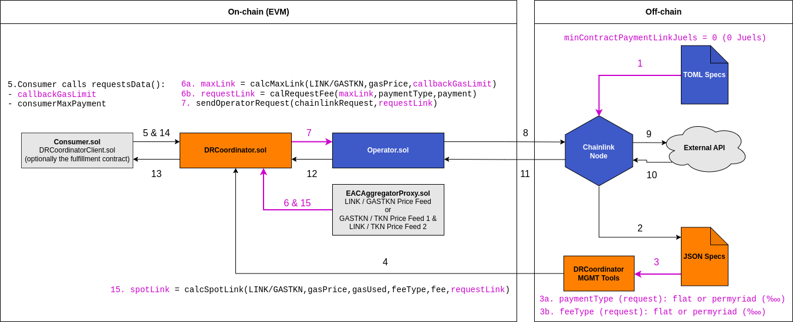

# Direct Request Coordinator (DRCoordinator)

A framework that enables dynamic LINK payments on Direct Request (Any API), syncing the price with the network gas and token conditions. It targets NodeOps that seek being competitive on their Direct Request operations.

## Chainlink Direct Request

### What is?

Direct Request (aka Any API) is a Chainlink product that allows requests of any API & service from a blockchain where the request is triggered by an on-chain event. A high level overview includes the following steps:

1. A NodeOp adds a `directrequest` Job on its node. A [`directrequest`](https://docs.chain.link/docs/jobs/types/direct-request/) job specification (job spec) is a TOML file that defines, in dot notation, a set of tasks to be executed upon an [`OracleRequest`](https://github.com/smartcontractkit/chainlink/blob/develop/contracts/src/v0.7/Operator.sol#L47) event emitted by the [`Oracle`](https://github.com/smartcontractkit/chainlink/blob/master/contracts/src/v0.6/Oracle.sol) or [`Operator`](https://github.com/smartcontractkit/chainlink/blob/master/contracts/src/v0.7/Operator.sol) contract (aka Oracle). These tasks determine how to request APIs, process their response, and submit the result on-chain. Some API integrations (e.g. request requirements, processing the response, etc.) are too complex for their built-in core tasks (e.g. `http`, `jsonparse`) and an [External Adapter (EA](https://docs.chain.link/docs/external-adapters/) must be used. An EA is an integration-specific server that [bridges](https://docs.chain.link/docs/node-operators/) a job run with an API and provides enhanced request and response processing capabilities. Both jobs and EAs can be implemented by anyone (NodeOp, client, anonymous dev, etc.) but to be used they are required to be available in the Chainlink node first.
2. The NodeOp shares the Job details with the customer who implements the Consumer contract (Consumer) using the [`ChainlinkClient`](https://docs.chain.link/docs/architecture-request-model/#chainlinkclient) library. The main role of the Consumer is to build a [`Chainlink Request`](https://docs.chain.link/docs/any-api/api-reference/#chainlinkrequest), send it, then fulfill it. The request is a Chainlink.Request object that contains the unique job details and the API request parameters (in Solidity) [CBOR encoded](https://github.com/smartcontractkit/chainlink/blob/master/contracts/src/v0.8/vendor/CBORChainlink.sol) (from [Concise Binary Object Representation](https://en.wikipedia.org/wiki/CBOR)).
3. To request the job, the Consumer transfers [LINK](https://github.com/smartcontractkit/LinkToken/blob/master/contracts/v0.4/LinkToken.sol#L27) (via the [`LinkToken.transferAndCall`](https://github.com/smartcontractkit/LinkToken/blob/master/contracts/v0.4/LinkToken.sol#L27) method) to the Oracle and attaches the [`Chainlink.Request`](https://github.com/smartcontractkit/chainlink/blob/master/contracts/src/v0.8/Chainlink.sol#L16) data as payload. The Oracle emits the `OracleRequest` event (including the payload) after receiving the LINK payment.
4. Then, the Chainlink node subscribed to the event triggers a job run. Along with the job execution, the [event data is decoded](https://docs.chain.link/docs/jobs/task-types/eth-abi-decode-log/), the request [parameters are processed](https://docs.chain.link/docs/jobs/task-types/cborparse/) and used to request the APIs (via either [`http`](https://docs.chain.link/docs/jobs/task-types/http/) task or [`bridge`](https://docs.chain.link/docs/jobs/task-types/bridge/) task). Finally, the responses are processed and the result is submitted on-chain back to the Consumer via the Oracle thus fulfilling the request.

Resources:

- [Chainlink docs - Direct Request Jobs (Direct Request from NodeOp point of view)](https://docs.chain.link/docs/jobs/types/direct-request/)
- [Chainlink docs - Any API (Direct Request from Consumer point of view)](https://docs.chain.link/docs/any-api/introduction/)
- [Chainlink docs - Chainlink Arquitecture, Basic Request Model](https://docs.chain.link/docs/architecture-request-model/)
- [LinkPool docs - Lifecycle of a Chainlink Request](https://docs.linkpool.io/docs/general_chainlink_guide)

### The Pricing Problem

In the current model the LINK payment is statically defined in the TOML job spec (in the `minContractPaymentLinkJuels` field), which has the following implications:

- The LINK amount is fixed on the off-chain side; no dynamism.
- Consumers don't have access to the exact amount and NodeOps must let them know about any change on it.
- Consumer transfers to Operator the LINK amount before the job runs and without knowing the outcome.
- NodeOps must calculate the LINK payment amount factoring in at least:
  - The gas units incurred by the fulfillment tx (result-size-dependant).
  - The gas price (in GASTKN) and the LINK price in the network.
- However, there are other factors too, e.g. changes on the result-size, frequency of gas spikes/network usage, gas bumps done by the Chainlink Node to assure tx inclusion, the L1 tx fees on L2s, etc. It is reasonable then that NodeOps set the LINK payment amount high enough to offset any potential losses.
- Adding a Direct Request job implies having to spend time calculating the LINK amount.
- NodeOps that manage multiple jobs (on multiple nodes and networks) struggle to keep each `minContractPaymentLinkJuels` up to date. Also take into account that the amount is probably changed via GUI.

### What if?

- The Direct Request model adopted the same major improvements VRF v2 had? Pay-as-you-go based on the gas used on request fulfillment plus some profit margin set by the node operator (paid in LINK leveraging the Chainlink Price Feeds). On-demand callback `gasLimit` set by the requester. And a versatile subscription model that eases funding the requests.
- NodeOps didn't have to worry anymore about token prices, network conditions, and just focus on profit margin? What about if the "last mile" of adding a job wasn't that time consuming and inaccurate?
- NodeOps had a framework to manage all of this, and consumers could verify it on-chain?

Well, these were the motivations behind DRCoordinator.

## DRCoordinator

## What is DRCoordinator?

A framework composed of contracts (on-chain) and job spec management tools (off-chain), that enable Consumer to pay NodeOp only as much LINK is required to cover the gas costs incurred by the data delivery, plus some profit margin set by the NodeOp.

## Architecture & Flow

This is a high level overview of the Direct Request Model with DRCoordinator:

### 1. Deploying a DRCoordinator

NodeOps have to deploy and set up first a DRCoordinator:

- Deploy, set up and verify a DRCoordinator using the `drcoordinator:deploy` Hardhat task.
  - NB: By default it will attempt to fetch the LINK / TKN Price Feed on the network and it will error if it is not found. In this case NodeOps will require to deploy in Multi Price Feed mode (See [Price Feed Contract Addresses](https://docs.chain.link/data-feeds/price-feeds/addresses) for choosing the right Price Feeds).
- Amend any non-immutable config after deployment using the `drcoordinator:set-config` Hardhat task.
- NodeOps can check the DRCoordiantor storage detail using the `drcoordinator:detail` Hardhat task.

### 2. Adding the job on the Chainlink node

NodeOps have to add a DRCoordinator-friendly TOML job spec (image no 1), which only requires to:

- Set the `minContractPaymentLinkJuels` field to 0 Juels. Make sure to set first the node env var `MINIMUM_CONTRACT_PAYMENT_LINK_JUELS` to 0 as well.
- Add the DRCoordinator address in `requesters` to prevent the job being spammed (due to 0 Juels payment).
- Add an extra data encode as `(bytes32 requestId, bytes data)` (via `ethabiencode` or `ethabiencode2` tasks) before encoding the data for the `fulfillOracleRequest2` tx.

### 3. Making the job requestable

NodeOps have to:

1. Create the `Spec` (see `SpecLibrary.sol`) of the TOML spec added above (image no 2 & 3) and upload it in the DRCoordinator storage via `DRCoordinator.setSpec()` (image no 4).

- NodeOps should create the equivalent JSON Spec and upload it using the `drcoordinator:import-file` Hardhat task.

2. Use `DRCoordinator.addSpecAuthorizedConsumers()` if on-chain whitelisting of consumers is desired.
3. Share/communicate the `Spec` details (via its key) so the Consumer devs can monitor the `Spec` and act upon any change on it, e.g. `fee`, `payment`, etc.

### 4. Implementing the Consumer

Devs have to:

- Make Consumer inherit from `DRCoordinatorClient.sol` (an equivalent of `ChainlinkClient.sol` for DRCoordinator requests). This library only builds the `Chainlink.Request` and then sends it to DRCoordinator (via `DRCoordinator.requestData()`), which is responsible for extending it and ultimately sending it to Operator.
- Request a `Spec` by passing the Operator address, the maximum amount of gas willing to spend, the maximum amount of LINK willing to pay and the `Chainlink.Request` (which includes the `Spec.specId` as `id` and the request parameters CBOR encoded) (image no 5).

Devs can time the request with any of these strategies if gas prices are a concern:

- Call `DRCoordinator.calculateMaxPaymentAmount()`.
- Call `DRCoordinator.calculateSpotPaymentAmount()`.
- Call `DRCoordinator.getFeedData()`.

### 5. Requesting the job spec

NB: Make sure Consumer has LINK balance in DRCoordinator.

When Consumer calls `DRCoordinator.requestData()` DRCoordinator does (image no 5):

1. Validates the arguments.
2. Calculates MAX LINK payment amount, which is the amount of LINK Consumer would pay if all the `callbackGasLimit` was used fulfilling the request (tx `gasLimit`) (image no 6).
3. Checks that the Consumer balance can afford MAX LINK payment and that Consumer is willing to pay the amount.
4. Calculates the LINK payment amount (REQUEST LINK payment) to be hold in escrow by Operator. The payment can be either a flat amount or a percentage (permyriad) of MAX LINK payment. The `paymentType` and `payment` are set in the `Spec` by NodeOp.
5. Updates Consumer balancee.
6. Stores essential data from Consumer, `Chainlink.Request` and `Spec` in a `FulfillConfig` (by request ID) struct to be used upon fulfillment.
7. Extends the Consumer `Chainlink.Request` and sends it to Operator (paying the REQUEST LINK amount) (image no 7), which emits the `OracleRequest` event (image no 8).

### 6. Requesting the Data Provider(s) API(s), processing the response(s) and submitting the result on-chain

NB: all these steps follow the standard Chainlink Direct Request Model.

1. The Chainlink node subscribed to the event triggers a `directrequest` job run.
2. The `OracleRequest` event data is decoded and the log and request parameters are processed and (9) used to request the Data Povider(s) API(s) (image no 9).
3. The API(s) response(s) (image no 10) are processed and the result is submitted on-chain back to DRCoordinator via `Operator.fulfillOracleRequest2()` (image no 11 & 12).

- NB: forwarding the response twice (i.e. Operator -> DRCoordinator -> Consumer) requires to encode the result as `bytes` twice (via `ethabiencode` or `ethabiencode2`)./
- NB: the `gasLimit` parameter of the `ethtx` task has set the amount defined by Consumer when called `DRCoordinator.requestData()` plus `GAS_AFTER_PAYMENT_CALCULATION` (`50_000` gas units).

### 7. Fulfilling the request

1. Validates the request and its caller.
2. Loads the request configuration (`FulfillConfig`) and attempts to fulfill the request by calling the Consumer callback method passing the response data (image no 13 & 14).
3. Calculates SPOT LINK payment, which is the equivalent gas amount used fulfilling the request in LINK, minus the REQUEST LINK payment, plus the fulfillment fee (image no 15). The fee can be either a flat amount of a percentage (permyriad) of SPOT LINK payment. The `feeType` and `fee` are set in the `Spec` by NodeOp.
4. Checks that the Consumer balance can afford SPOT LINK payment and that Consumer is willing to pay the amount. It is worth mentioning that DRCoordinator can refund Consumer if REQUEST LINK payment was greater than SPOT LINK payment and DRCoordinator's balance is greater or equal than SPOT payment. Tuning the `Spec.payment` and `Spec.fee` should make this particular case very rare.
5. Updates Consumer and DRCoordinator balances.

## On-chain elements

- [DRCoordinator contracts](./contracts/drcoordinator/)

- [Example of DRCoordinatorClient contracts](./contracts/drcoordinator/v0.8/dev/)

- [Chainlink contracts](./contracts/chainlink/) (used for NodeOps tasks, and DRCoordinator tests)

## Off-chain elements

### Hardhat tasks

- [DRCoordinator tasks](./tasks/drcoordinator/)

- [Tools](./tasks/tools/)

- [Chainlink tasks](./tasks/chainlink/)

### DRCoordinator Job Specs

- [TOML specs](./jobs/toml-specs/)

- [JSON specs](./jobs/drcoordinator-specs/)

## How To's & More

### DRCoordinatior 1.0.0

- [How To 01: Introduction to DRCoordinator](./media/how_to_01_introduction_to_drcoordinator_1_0_0.md)

- [Slide deck](https://docs.google.com/presentation/d/1nSMWzI_lfHa9cPBz0lPQ6jDwo-UWSzmTVCaIAvzkI_A/edit?usp=sharing)

### DRCoordinator 0.1.0 (deprecated)

- [README.md](./media/README_drcoordinator_0_1_0.md)
- [How To 01: Introduction to DRCoordinator](./media/how_to_01_introduction_to_drcoordinator_0_1_0.md)
- [Chainlink Hackaton 2022 Spring submission](./media/README_CHAINLINK_HACKATON_2022_01_SPRING.md)

## Resources

### Stack

- [Hardhat](https://github.com/nomiclabs/hardhat): compile and run the smart contracts on a local development network
- [TypeChain](https://github.com/ethereum-ts/TypeChain): generate TypeScript types for smart contracts
- [Ethers](https://github.com/ethers-io/ethers.js/): renowned Ethereum library and wallet implementation
- [Waffle](https://github.com/EthWorks/Waffle): tooling for writing comprehensive smart contract tests
- [Solhint](https://github.com/protofire/solhint): linter
- [Solcover](https://github.com/sc-forks/solidity-coverage): code coverage
- [Prettier Plugin Solidity](https://github.com/prettier-solidity/prettier-plugin-solidity): code formatter
- [Chainlink Smart Contracts](https://www.npmjs.com/package/@chainlink/contracts): Chainlink smart contracts and their ABIs

### Faucets

- [LINK](https://faucets.chain.link/)
- [AVAX Fuji](https://faucet.avax-test.network/)
- [BSC Testnet](https://testnet.binance.org/faucet-smart)
- [ETH Kovan](https://gitter.im/kovan-testnet/faucet)
- [ETH Rinkeby](https://faucet.rinkeby.io/)
- [ETH Goerli faucet](https://faucet.goerli.mudit.blog/)
- [FTM Opera](https://faucet.fantom.network/)
- [MATIC Mumbai](https://faucet.polygon.technology/)
- [OPT Goerli 1](https://optimismfaucet.xyz/)
- [OPT Goerli 2](https://faucet.paradigm.xyz/)
- [OPT Goerli 3](https://goerlifaucet.com/)
- [RSK](https://faucet.rsk.co/)
- [XDAI](https://xdai-faucet.top/)

### Explorers

- [ARB Goerli](https://goerli.arbiscan.io/)
- [ARB Mainnet](https://explorer.offchainlabs.com/)
- [ARB Rinkeby](https://rinkeby-explorer.arbitrum.io/)
- [AVAX Fuji](https://cchain.explorer.avax-test.network/)
- [AVAX Mainnet](https://cchain.explorer.avax.network/)
- [BSC Mainnet](https://bscscan.com/)
- [BSC Tesnet](https://testnet.bscscan.com/)
- [ETH Goerli](https://goerli.etherscan.io/)
- [ETH Kovan](https://kovan.etherscan.io/)
- [ETH Mainnet](https://etherscan.io/)
- [ETH Rinkeby](https://rinkeby.etherscan.io/)
- [FTM Mainnet](https://ftmscan.com/)
- [FTM Testnet](https://testnet.ftmscan.com/)
- [HECO Mainnet](https://scan.hecochain.com/)
- [HECO Testnet](https://scan-testnet.hecochain.com/home/index)
- [KLAYTN Baobab](https://baobab.scope.klaytn.com/)
- [MATIC Mainnet](https://polygonscan.com/)
- [MATIC Mumbai](https://mumbai.polygonscan.com/)
- [METIS Mainnet](https://andromeda-explorer.metis.io/)
- [MOONBEAM Mainnet](https://moonscan.io/)
- [MOONBEAM Moonriver](https://moonriver.moonscan.io/)
- [ONE Mainnet](https://explorer.harmony.one/)
- [OPT Goerli](https://goerli-optimism.etherscan.io/)
- [OPT Kovan](https://kovan-optimistic.etherscan.io/)
- [OPT Mainnet](https://optimistic.etherscan.io/)
- [POA Sokol](https://blockscout.com/poa/sokol/)
- [RSK Mainnet](https://explorer.rsk.co/)
- [XDAI Mainnet](https://blockscout.com/xdai/mainnet/)

### Free Tier Providers

NB: look for public RPCs on the official documentation of the aimed network.

- [Alchemy](https://www.alchemy.com/)
- [Infura](https://infura.io/)
- [QuickNode](https://www.quicknode.com/)
