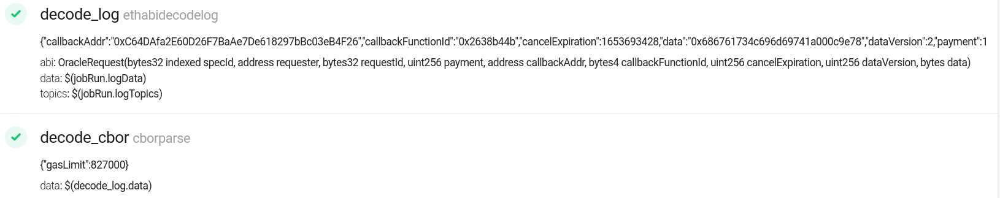
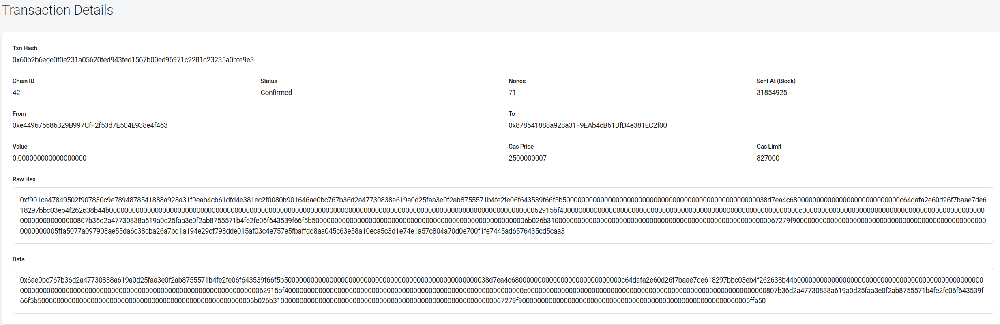
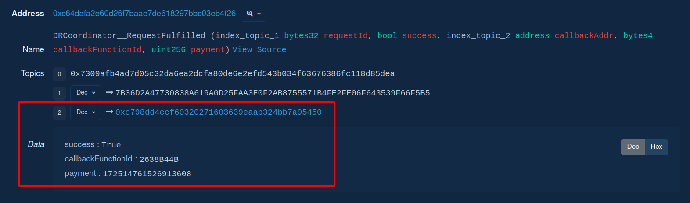
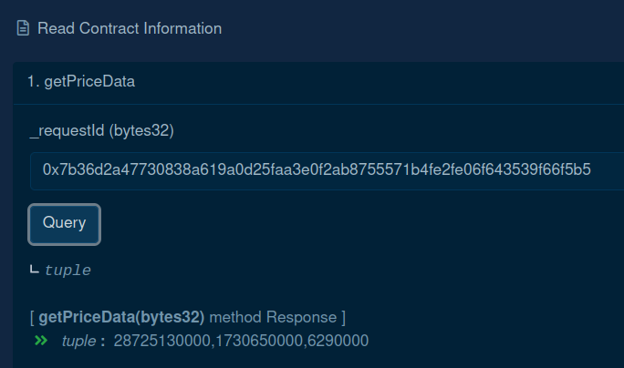

# How To: DRCoordinator Basic Tutorial

Follow the steps below to make a Multi Word Response Direct Request to the CryptoCompare API via `DRCoordinator`. The goal is writing on-chain the current USD price of BTC, ETH, and LINK.

Most of the tasks will be run with the bare configuration. See [DRCoordinator Tasks](./tasks/drcoordinator/README.md) to know more.

### 1. Pre-requisites

Environment: Node.js ^16.

Network: Ethereum Kovan.

Browser Wallet: Metamask.

Assets: ETH and LINK on Kovan. Get some on [Chainlink Faucets](https://faucets.chain.link/).

Providers: [Infura](https://infura.io/) and/or [Alchemy](https://www.alchemy.com/), although it is very easy to replace them by any other provider, JSON RPC, etc.

Block explorer: [kovan.etherscan](https://kovan.etherscan.io/).

Contract addresses: a deployed, setup and verified `Operator.sol`.

Chainlink Node: >= v1.0.0, try one at [NaaS.link](https://naas.link/).

1. Copy the [.env.example](./.env.example) as `.env`, and populate:

```
LOG_LEVEL=debug
PRIVATE_KEY=your private key
INFURA_API_KEY=the infura project ID
ETHERSCAN_API_KEY=etherscan api key
```

2. Make sure to load your `.env` again.

### 2. Deploy a DRCoordinator

Deploy and verify a `DRCoordinator.sol`:

```sh
yarn hardhat drcoordinator:deploy \
--description beta-3 \
--fallbackweiperunitlink "8000000000000000" \
--stalenessseconds "86400" \
--setup \
--verify \
--network eth-kovan
```

https://kovan.etherscan.io/address/0xC64DAfa2E60D26F7BaAe7De618297bBc03eB4F26#code

Log its detail with:

```sh
yarn hardhat drcoordinator:detail \
--address 0xC64DAfa2E60D26F7BaAe7De618297bBc03eB4F26 \
--keys \
--specs \
--network eth-kovan
```

Of course, there are no `keys`, nor `specs` to log yet.

### 3. Deploy a DRCoordinatorConsumer

Deploy, fund and verify a `DRCConsumerCryptoCompare.sol`. Make sure that:

- You have Kovan LINK (5 LINK in this example).
- Double checking the `drcoordintor` and `operator` addresses

```sh
yarn hardhat drcoordinator:deploy-consumer \
--name DRCConsumerCryptoCompare \
--drcoordinator 0xC64DAfa2E60D26F7BaAe7De618297bBc03eB4F26 \
--operator 0x878541888a928a31F9EAb4cB61DfD4e381EC2f00 \
--fund \
--amount "5000000000000000000" \
--verify \
--network eth-kovan
```

https://kovan.etherscan.io/address/0xc798dD4cCf60320271603639eaab324Bb7A95450#code

Log again the `DRCoordinator` detail to appreciate how it has now 5.0 LINK balance (although no profit)

```sh
yarn hardhat drcoordinator:detail \
--address 0xC64DAfa2E60D26F7BaAe7De618297bBc03eB4F26 \
--keys \
--specs \
--network eth-kovan
```

### 4. Import Specs into DRCoordinator

1. Open your Chainlink, click `New Job` and paste the [CryptoCompare Get Prices DRCoordinator fallback](./specs-toml/drcoordinator/cryptocompare-get-prices-fallback.toml).

2. Before saving it, do the following (make sure you use checksum addresses):

   - Replace the `requesters` zero address with your `DRCoordinator` address (`0xC64DAfa2E60D26F7BaAe7De618297bBc03eB4F26`).
   - Replace `minContractPaymentLinkJuels` with a tiny LINK amount, especially taking into account we are on Kovan, and submitting 3 `uint256` (not that much data). For instance `0.001` LINK (10^15) is good to go. Ideally you should help yourself with tasks like [drgenerator:calculate-max-amount](./tasks/drcoordinator/README.md#calculate-max-link-payment-amount), [drgenerator:calculate-spot-amount](./tasks//drcoordinator/README.md#calculate-spot-link-payment-amount), and [tools:gas:estimate](./tasks/tools/gas.ts).
   - Replace `contractAddress` with the `Operator` address (`0x878541888a928a31F9EAb4cB61DfD4e381EC2f00`).
   - On the `submit_tx` task, replace `to` with the `Operator` address (`0x878541888a928a31F9EAb4cB61DfD4e381EC2f00`).
     - IMPORTANT: also replace `minConfirmations="$(decode_cbor.minConfirmations)"` with `minConfirmations="2"` due to a bug on the `etht`.

3. Click `Create Job` and then go to the Definition tab (and leve it open).

4. Make a copy of the [example JSON specs file](./specs/example.json), and create your Spec helping yourself of the templates provided. Be aware that despite the `description` object won't be uploaded on-chain, it still validated (e.g. `chainId`, `nodeId`), as the purpose is helping the node operator to have very well defined and labelled Specs.

- (Optional) Replace `description.jobId` with the Definition ID.
- (Optional) Replace `description.jobName` with the TOML job spec one.
- (Optional) Add a comment in `description.notes`.
- Replace `configuration.externalJobId` with the Definition one.
- Set `configuration.feeType` to `1` (a permyriad - instead of a flat fee).
- Set `configuration.fulfillmentFee` to `"1000"` (a 10%).
- Set `configuration.gasLimit` to `777000` to show case the on-demand `gasLimit` feature (by default `ethtx` task will use `500000`).
- Replace `configuration.operator` with the `Operator` address (`"0x878541888a928a31F9EAb4cB61DfD4e381EC2f00"`).
- Replace `configuration.payment` with the Definition one, `"1000000000000000"` (10^15 - 0.001 LINK).

```json
[
  {
    "description": {
      "adapter": null,
      "chainId": 42,
      "jobId": 62,
      "jobName": "CryptoCompare Get Prices DRCoordinator fallback",
      "nodeId": "eth_kovan",
      "notes": "My first DRCoordinator request!"
    },
    "configuration": {
      "externalJobId": "cc677638-fe1b-4741-9bdf-8dd1d777a6a0",
      "feeType": 1,
      "fulfillmentFee": "1000",
      "gasLimit": 777000,
      "minConfirmations": 2,
      "operator": "0x878541888a928a31F9EAb4cB61DfD4e381EC2f00",
      "payment": "1000000000000000"
    }
  }
]
```

Optionally, you can validate the JSON specs file in advance and even generating its SHA-1 (stored on-chain for syncing purposes).

```sh
yarn hardhat drcoordinator:generate-sha1 \
--filename hackaton-demo \
--check
```

`sha1: 0xafef548de4799c0765f7bb1909726c93ecb29224` (yours will be different, unless you use JSON spec above).

5. Save the file and upload it into the `DRCoordinator` (optionally you can try the `dryrun` and/or `forking` mode):

```sh
yarn hardhat drcoordinator:import-file \
--address 0xC64DAfa2E60D26F7BaAe7De618297bBc03eB4F26 \
--filename hackaton-demo \
--mode prod \
--network eth-kovan
```

The result should be `adding specs into DRCoordinator ...`, the log of the Spec converted into `DRCoordinator` comaptible data, and a message saying that the `sha1` has been set.

https://kovan.etherscan.io/tx/0x77bfc921fd392ce7268850dd68105db1d5951e528b0408e16cb243b44402395f (`setSpecs()`)
https://kovan.etherscan.io/tx/0x7158e1ac06769969075e0b5d6161961e3f3336b2ade20bddb3ed9e3e3999f254 (`setSha1()`)

6. Log again the `DRCoordinator` details, and appreciate how much information has changed.

```sh
yarn hardhat drcoordinator:detail \
--address 0xC64DAfa2E60D26F7BaAe7De618297bBc03eB4F26 \
--keys \
--specs \
--network eth-kovan
```

There is one item on `keys` and one `Spec`.

### 5. Make a DRCoordinator request

1. Open your [DRConsumerCryptoCompare](https://kovan.etherscan.io/address/0xc798dD4cCf60320271603639eaab324Bb7A95450#code) on Kovan Etherscan, go to Write Contract, and click Connect to Web3.

2. Convert the `externalJobID` UUIDv4 to a `specId` (bytes32) via:

```sh
yarn hardhat drcoordinator:jobid-to-bytes32 \
--jobid cc677638-fe1b-4741-9bdf-8dd1d777a6a0
```

3. Extend the `3. requestPrices` dropdown, and insert the following inputs:

\_specId (bytes32)

```
0x6363363737363338666531623437343139626466386464316437373761366130
```

\_callbackGasLimit (uint48)

```
777000
```

\_callbackMinConfirmations (uint8)

```
2
```

\_fulfillMode (uint8)

```
0
```

IMPORTANT: if you are using Metamask, you'll see the GUI is not able to estimate gas. If all the steps have been done correctly it won't revert. Therefore click `I will try anyway` and Confirm. Below the transaction:

https://kovan.etherscan.io/tx/0x82a9c0cbd372fd8aa1e45d73aa17d12ffd585fa8bd1f3f86dcc4ec5c47ed0af9 (`LINK.transferAndCall()`)

As you can see 0.001 LINK was transferred from the `DRCoordinator` (consumer balance) to the `Operator`.
Inspecting the `ChainlinkRequested` logged event (Topics 1), the `requestId` is `0x7b36d2a47730838a619a0d25faa3e0f2ab8755571b4fe2fe06f643539f66f5b5`.

4. Go to the job detail on your Chainlink node and check how `gasLimit` made it into the job run (`minConfirmations` excluded due to the bug). Worth mentioning that the `gasLimit` amount is not `777000` but `827000`. The reason is that the requester has specified `777000` gas units on fulfillment, but `DRCoordinator` needs gas too for few operations after fulfilling the request (calculating and subtracting the LINK payment amount, deleting the pending request, and emitting ane event). The minimum amount of gas needed to do so is `GAS_AFTER_PAYMENT_CALCULATION = 50_000` (a constant in the contract). Therefore `ethx gasLimit (827000) = consumer gasLimit (777000) + DRCoordinator GAS_AFTER_PAYMENT_CALCULATION (50000)`.



Detail of how `gasLimit` from `cborparse` output is used on the `ethtx` task:


Transaction detail:



https://kovan.etherscan.io/tx/0x60b2b6ede0f0e231a05620fed943fed1567b00ed96971c2281c23235a0bfe9e3

5. The tx had a `gasLimit` of `827000` and used `176543` gas units. The `gasPrice` was `2.5` gwei. Inspecting the event logs, we see that all 3 events emitted (`OracleResponse`, `ChainlinkFulfilled`, and `DRCoordinator__RequestFulfilled`) were related with the previous requestId `0x7b36d2a47730838a619a0d25faa3e0f2ab8755571b4fe2fe06f643539f66f5b5`.



A more in detail look at the event emitted by `DRCoordinator` tell us that fulfilling the request to `0xc798dD4cCf60320271603639eaab324Bb7A95450` (callback address) on `2638B44B` (the function selector) succeeded (`true`). Also that the LINK payment amount subtracted by `DRCoordinator` to `DRCConsumerCryptoCompare` balances was `172514761526913608`. These 0.1725 LINK discounted first the initial 0.001 LINK payment, and then applied the 10% fee set in our JSON spec.

6. Going to [DRCConsumerCryptoCompare Read Contract Information](https://kovan.etherscan.io/address/0xc798dD4cCf60320271603639eaab324Bb7A95450#readContract), expanding the `1. getPriceData` dropdown, and introducing the requestId `0x7b36d2a47730838a619a0d25faa3e0f2ab8755571b4fe2fe06f643539f66f5b5`, we'll load the result; the USD price of BTC, ETH, and LINK (each one multiplied by 100000).



7. Going to [DRCoordinator Read Contract Information](https://kovan.etherscan.io/address/0xc64dafa2e60d26f7baae7de618297bbc03eb4f26#readContract), expanding the `8. availableFunds` dropdown, and adding the addresses of `DRCConsumerCryptoCompare` and `DRCoordinator`, we check their current balances:

- DRCConsumerCryptoCompare: 4826485238473086392 (4.826 LINK)
  - From 5 LINK (initial balance) - 0.001 LINK (initial request payment amount, hold by the `Operator`) - 0.1725 LINK (fulfillment payment amount)
- DRCoordinator: 172514761526913608 (0.1725 LINK)

Logging again the `DRCoordinator` detail, we'll see its balance (4.999 LINK), and its profit (0.1725 LINK).

```sh
yarn hardhat drcoordinator:detail \
--address 0xC64DAfa2E60D26F7BaAe7De618297bBc03eB4F26 \
--network eth-kovan
```
